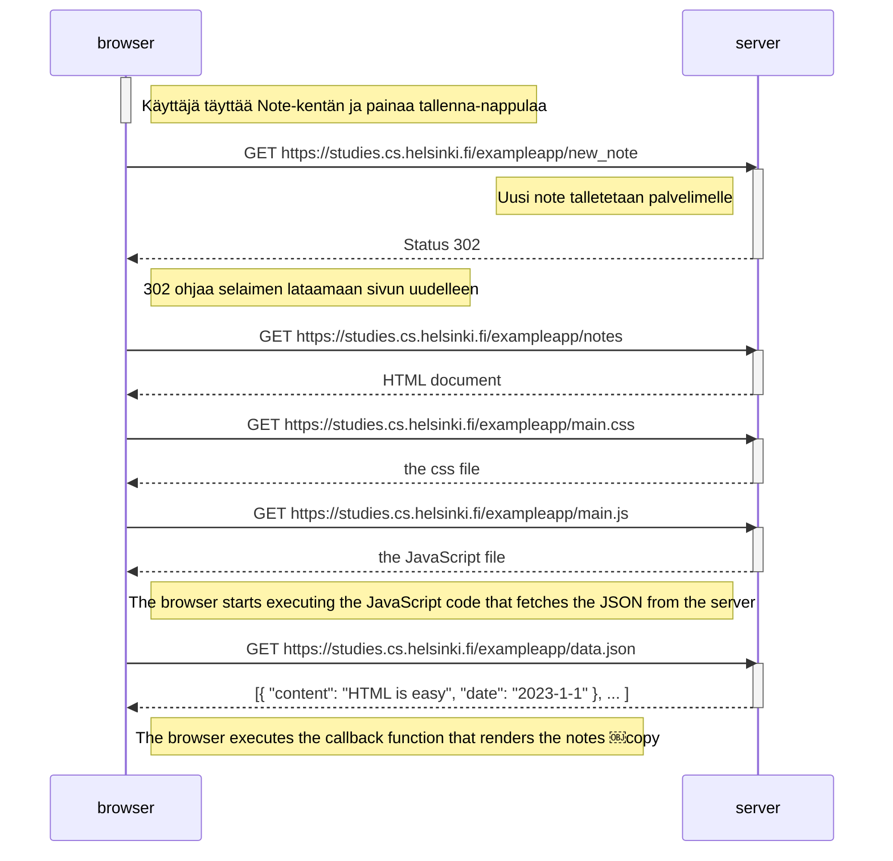
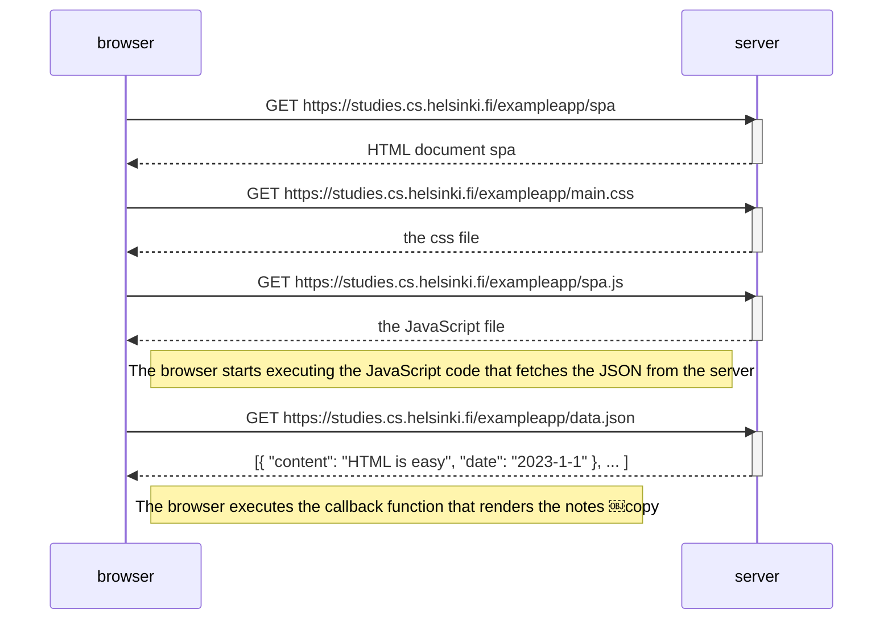
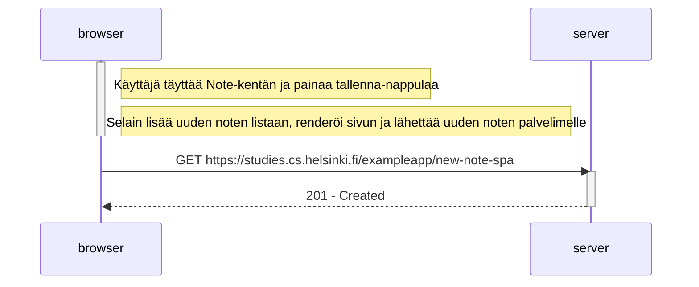

0.4: Uusi muistiinpano, sekvenssikaavio

```mermaid
sequenceDiagram
    participant browser
    participant server

    activate browser
    Note right of browser: Käyttäjä täyttää Note-kentän ja painaa tallenna-nappulaa
    deactivate browser

    browser->>server: GET https://studies.cs.helsinki.fi/exampleapp/new_note
    activate server
    Note left of server: Uusi note talletetaan palvelimelle
    server-->>browser: Status 302
    deactivate server
    Note right of browser: 302 ohjaa selaimen lataamaan sivun uudelleen

    browser->>server: GET https://studies.cs.helsinki.fi/exampleapp/notes
    activate server
    server-->>browser: HTML document
    deactivate server

    browser->>server: GET https://studies.cs.helsinki.fi/exampleapp/main.css
    activate server
    server-->>browser: the css file
    deactivate server
    
    browser->>server: GET https://studies.cs.helsinki.fi/exampleapp/main.js
    activate server
    server-->>browser: the JavaScript file
    deactivate server
    
    Note right of browser: The browser starts executing the JavaScript code that fetches the JSON from the server
    
    browser->>server: GET https://studies.cs.helsinki.fi/exampleapp/data.json
    activate server
    server-->>browser: [{ "content": "HTML is easy", "date": "2023-1-1" }, ... ]
    deactivate server    

    Note right of browser: The browser executes the callback function that renders the notes copy
```

0.5: Single Page App

```mermaid
sequenceDiagram
    participant browser
    participant server

    browser->>server: GET https://studies.cs.helsinki.fi/exampleapp/spa
    activate server
    server-->>browser: HTML document spa
    deactivate server

    browser->>server: GET https://studies.cs.helsinki.fi/exampleapp/main.css
    activate server
    server-->>browser: the css file
    deactivate server
    
    browser->>server: GET https://studies.cs.helsinki.fi/exampleapp/spa.js
    activate server
    server-->>browser: the JavaScript file
    deactivate server
    
    Note right of browser: The browser starts executing the JavaScript code that fetches the JSON from the server
    
    browser->>server: GET https://studies.cs.helsinki.fi/exampleapp/data.json
    activate server
    server-->>browser: [{ "content": "HTML is easy", "date": "2023-1-1" }, ... ]
    deactivate server    

    Note right of browser: The browser executes the callback function that renders the notes copy
```
0.6: Single Page App- uusi muistiinpano

```mermaid
sequenceDiagram
    participant browser
    participant server

    activate browser
    Note right of browser: Käyttäjä täyttää Note-kentän ja painaa tallenna-nappulaa
    Note right of browser: Selain lisää uuden noten listaan, renderöi sivun ja lähettää uuden noten palvelimelle
    deactivate browser

    browser->>server: GET https://studies.cs.helsinki.fi/exampleapp/new-note-spa
    activate server
    server-->>browser: 201 - Created
    deactivate server

```

